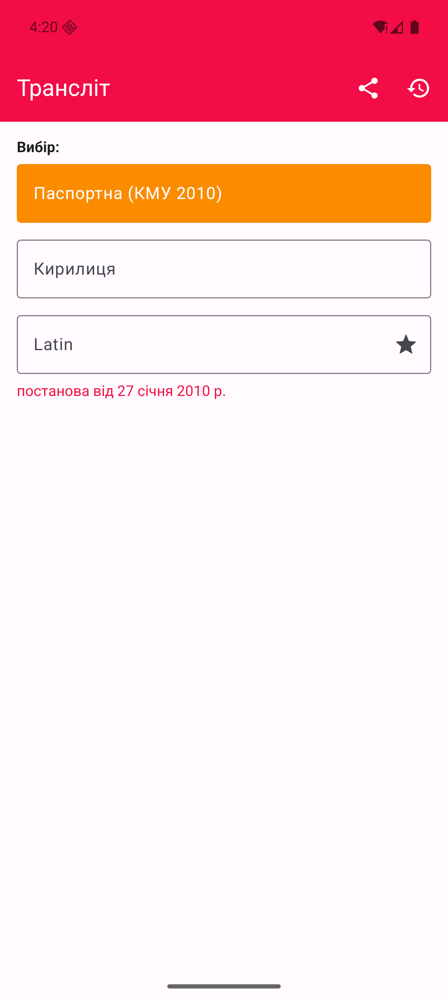
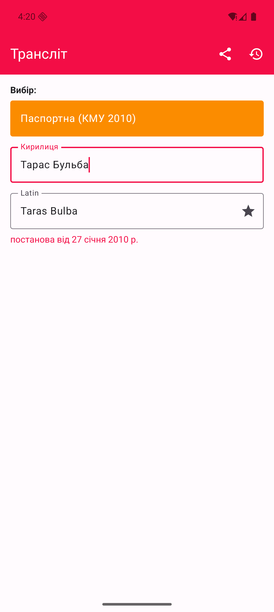
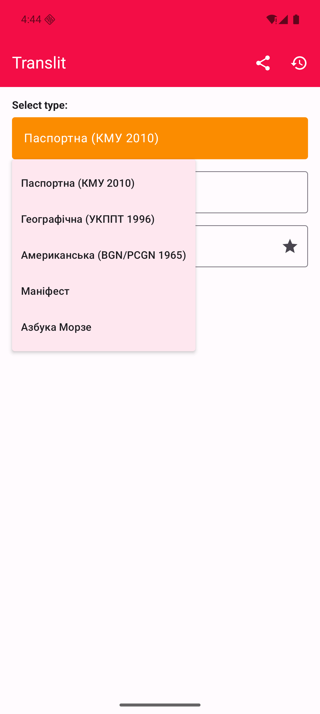

# Транслітерація - тексту кирилиці в латиницю.

__Хочете допомогти? [Задонатити](https://send.monobank.ua/jar/4qhFtZFqTc)__

|  |  |  |
|----------------------------------------------------------------------------------------|------------------------------------------------------------------------------------------|--------------------------------------------------------------------------------------|

## Словники

- [Паспортна (КМУ 2010)](http://latynka.tak.today/works/pasportnyj/) [закон](https://zakon.rada.gov.ua/laws/show/55-2010-%D0%BF#Text)

Приклади:

| Оригінал   | Трансліт      |
|------------|---------------|
| Алушта     | Alushta       |
| Андрій     | Andrii        |
| Борщагівка | Borshchahivka |
| Згурський  | Zghurskyi     |
| Ґалаґан    | Galagan       |
| Ґорґани    | Gorgany       |
| Донецьк    | Donetsk       |
| Ярошенко   | Yaroshenko    |
| Костянтин  | Kostiantyn    |
| Знам'янка  | Znamianka     |
| Феодосія   | Feodosiia     |

- [Географічна (УКППТ 1996)](http://latynka.tak.today/works/ukppt-1996-spr/)

- [Американська (BGN/PCGN 1965)](http://latynka.tak.today/works/bgnpcgn-1965/)

- [Азбука Морзе]()
